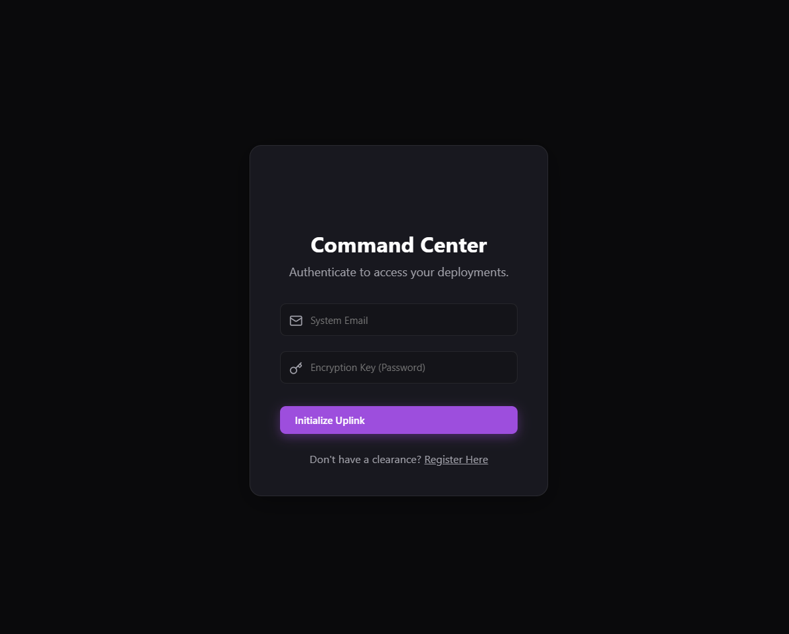
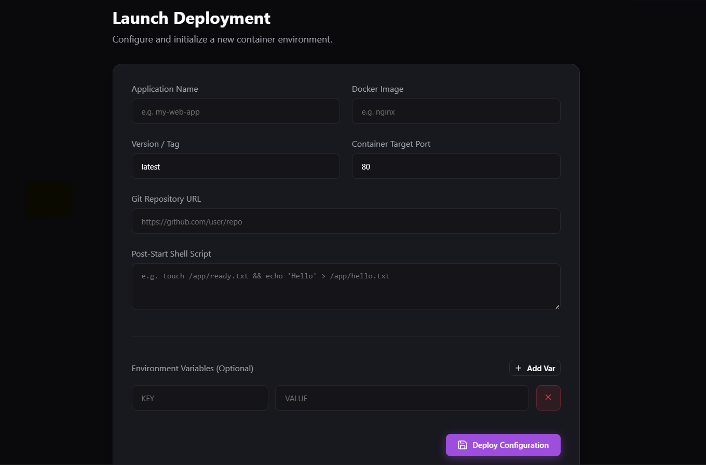
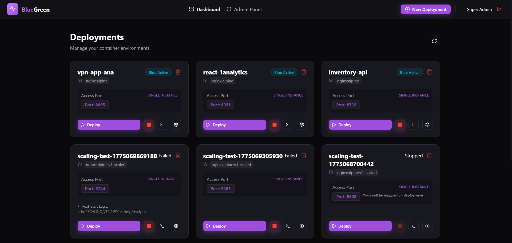
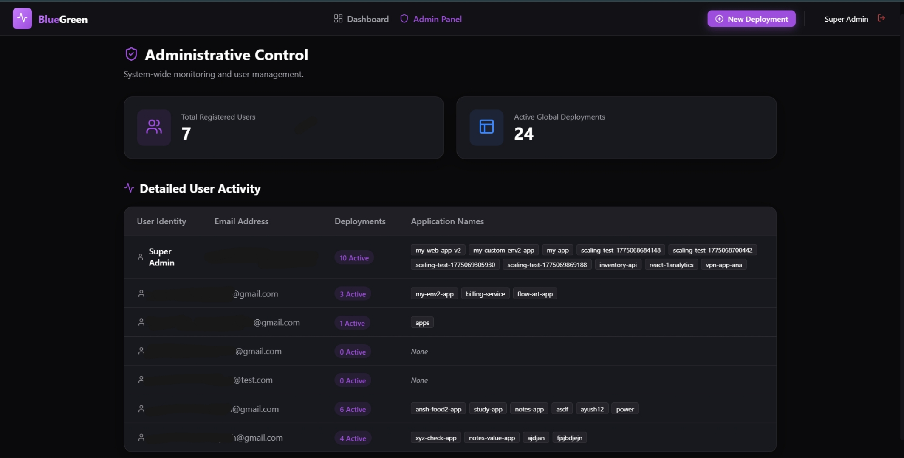

# 🚀 Container Deployment Manager

A sophisticated, multi-tenant container orchestration platform that executes **zero-downtime blue-green deployments** directly coupled with role-based access control and live monitoring. 

   

---

## 🎨 Features

| Feature | Description |
|---------|-------------|
| 🔄 **Blue-Green Deployments** | Zero-downtime updates via smooth physical port swapping. |
| 🛡️ **Tenant Isolation** | Isolated orchestration domains per registered user. |
| 👑 **Admin Control Center** | Top-level visibility over user fleets and cluster-wide metrics. |
| 📡 **Live Log Streams** | Real-time container logs streamed to the UI via Server-Sent Events (SSE). |
| ❤️ **Health Validations** | Strict startup health-checks before traffic proxy rerouting. |
| 🐳 **Docker Integration** | Direct communication with the native Docker Engine API. |
| 🔐 **Secure Auth** | JWT-based session management and bcrypt password hashing. |
| 📊 **Dynamic Dashboard** | Premium UI displaying active ports, container status, and telemetry. |

---

## 📸 Interface Showcases

### Command Center (Login Gateway)


### New Deployment Console


### Main Dashboard (Deployment Orchestration Hub)


### Application Admin Console



---

## 📁 Project Structure

```
container-deployment-manager/
├── src/                        # Node.js + Express API Backend
│   ├── controllers/            # Logic for auth, deployments, and admin
│   ├── middlewares/            # JWT validation and authorization
│   ├── models/                 # Mongoose schemas (User, Deployment)
│   ├── routes/                 # Express API route definitions
│   ├── services/               # Core Docker & Proxy bridging logic
│   ├── app.js                  # Entry point & Reverse Proxy Setup
│   └── proxy.js                # Traffic routing controller
│
├── frontend/                   # React + Vite Application
│   ├── src/
│   │   ├── api/                # Axios client configurations
│   │   ├── components/         # Reusable UI elements & Modals
│   │   ├── context/            # Global Auth Context
│   │   ├── pages/              # Auth, Dashboard, AdminDashboard
│   │   ├── App.jsx             # React Router setup
│   │   └── index.css           # Vanilla CSS Custom Theme Variables
│   ├── index.html
│   └── vite.config.js          # Vite config & dev proxy rules
│
├── .env                        # Environment configurations
└── package.json                # Project dependencies
```

---

## 🚀 Setup & Installation

### Prerequisites
- **Node.js** v18 or newer
- **MongoDB** running locally on port `27017` or configured via `MONGO_URI`
- **Docker Desktop** running in the background (Required for orchestration)

---

### Step 1 — Setup Backend Environment
Create and configure the `.env` file in the root directory:
```env
PORT=31234
MONGO_URI=mongodb://localhost:27017/container-deployment
JWT_SECRET=super_secret_deployment_key
```

### Step 2 — Install Backend Dependencies

```bash
cd container-deployment-manager
npm install
```

### Step 3 — Start the Backend Server

```bash
npm start
```
Expected output:
```
✅ Database Connected
🚀 Deployment Engine active on http://localhost:31234
```

### Step 4 — Install Frontend Dependencies

```bash
# Open a new terminal
cd container-deployment-manager/frontend
npm install
```

### Step 5 — Start the Frontend Development Server

```bash
# Inside the frontend/ directory
npm run dev
```
Expected output:
```
  ➜  Local:   http://localhost:5173/
```

### Step 6 — Enter Command Center
Open **http://localhost:5173** in your browser. Register an admin account, login, and start executing deployments!

---

## 🔌 API Reference

### Built-in Auth Endpoints (`/api/auth`)
| Method | Route | Description |
|--------|-------|-------------|
| POST | `/register` | Register a new user |
| POST | `/login` | Authenticate and obtain JWT token |
| GET | `/me` | Retrieve the active user payload |

### Deployment Endpoints (`/api/deployments`)
| Method | Route | Description |
|--------|-------|-------------|
| GET | `/` | List all deployments for the active user |
| POST | `/` | Create a new deployment configuration |
| POST | `/:id/deploy` | Trigger a new zero-downtime container launch |
| POST | `/:id/stop` | Execute an emergency halt on a running container |
| DELETE | `/:id` | Eradicate a deployment entirely |
| GET | `/:id/logs` | (SSE stream) Stream live stdout container logs |

---

## 🧠 How It Works — The Blue-Green Shuffle

The orchestration strictly manages container lifecycles to guarantee users experience zero drop-offs during an upgrade. 

1. **Active State**: App v1 runs on the physical **Blue Port** (e.g. `8145`). Our reverse proxy points all user traffic here.
2. **Launch Update**: App v2 is requested. The backend downloads the image and spins it up on the dormant **Green Port** (e.g. `9231`). 
3. **Health Check**: The orchestrator continuously pings the green port until it confirms it is stable and absorbing requests.
4. **Proxy Swivel**: The internal reverse proxy is instantly pointed away from Blue and towards the Green Port.
5. **Clean Up**: App v1 is taken offline and cleanly removed to conserve CPU/RAM resources.

---

## 🛠️ Tech Stack

| Layer | Technology |
|-------|-----------|
| Frontend | React 18 + Vite |
| Design | Custom Vanilla CSS (Glassmorphism & Gradients) |
| Backend | Node.js + Express 5.x |
| Proxy | Node `http-proxy` |
| Database | MongoDB + Mongoose |
| AI / Automation | Native Docker CLI integrations |
| Auth | JWT + bcryptjs |

---

## ⚡ Performance Tips

- **Docker Memory Allocation**: Ensure Docker Desktop has at least 4GB RAM allocated if running multiple heavily customized images.
- **Use Alpine Images**: Specify lightweight base tags (like `node:18-alpine` or `nginx:alpine`) to keep deployment times incredibly short.
- **Clean Images Mode**: Periodically execute `docker system prune` when operating in heavy development mode to clear orphaned images.

---

## 📝 License

MIT — Free to use, fork, and orchestrate!
